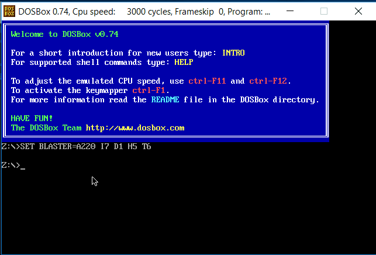

# Sentences-Similarity #  
A project written in Assembly x86 that calculates the similarity between two sentences

# How it works #  
1. Read the first  sentence from "DATA1.txt" and save it in s1  
2. Read the second sentence from "DATA2.txt" and save it in s2  
3. Remove punctuation marks in s1 and s2 which are 14  
	a. /  
	b. .  
	c. ?  
	d. !  
	e. :  
	f. ;  
	g. -  
	h. —  
	i. ( )  
	j. [ ]  
	k. . . .   
	l. ’  
	m. “ ”  
	n. ,  

** for [] and () we will remove the opening parantheses then the closing.  

4. Make all characters in s1 and s2 small letters  

5. Remove stop words from s1 and s2  
	a. I  
	b. a  
	c. an  
	d. as  
	e. at  
	f. the  
	g. by  
	h. in  
	i. for  
 	j. of  
	k. on  
	l. that  
6. Remove duplicate words from s1 and s2  
7. Calculate the similarity  

	Similarity = (𝑆1 ∩ 𝑆2) / (𝑆1 ∪ 𝑆2)  

(𝑆1 ∩ 𝑆2) : the size of the intersection of words between s1 and s2 "length(s3 = (𝑆1 ∩ 𝑆2))"   
(𝑆1 ∪ 𝑆2) : the size of the union        of words between s1 and s2  

# Demo #  
Watch this short video that runs the code using dosbox and TASM.  
  
  
    
    

